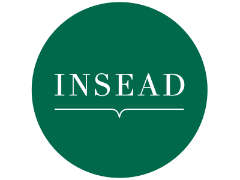
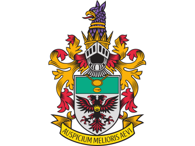



## About me

Low Wu Yang Andre  
刘宇扬  
34 years old  
Married, with one child

## Bio



An only child to two MOE teachers, I was taught from a young age to embrace curiosity and ask questions of the world around me.

Today, I am stepping up to build a better future for Singapore, one that embraces diverse perspectives, dares to dream and experiment, and makes sure no Singaporean is ever left behind.

I am humbled to be given the opportunity to serve as an NCMP. My pledge to all Singaporeans is that I will use my platform to continue to advocate for a more balanced and diverse political system.

## Career highlights


  
  
  


## Education


  
  
  
